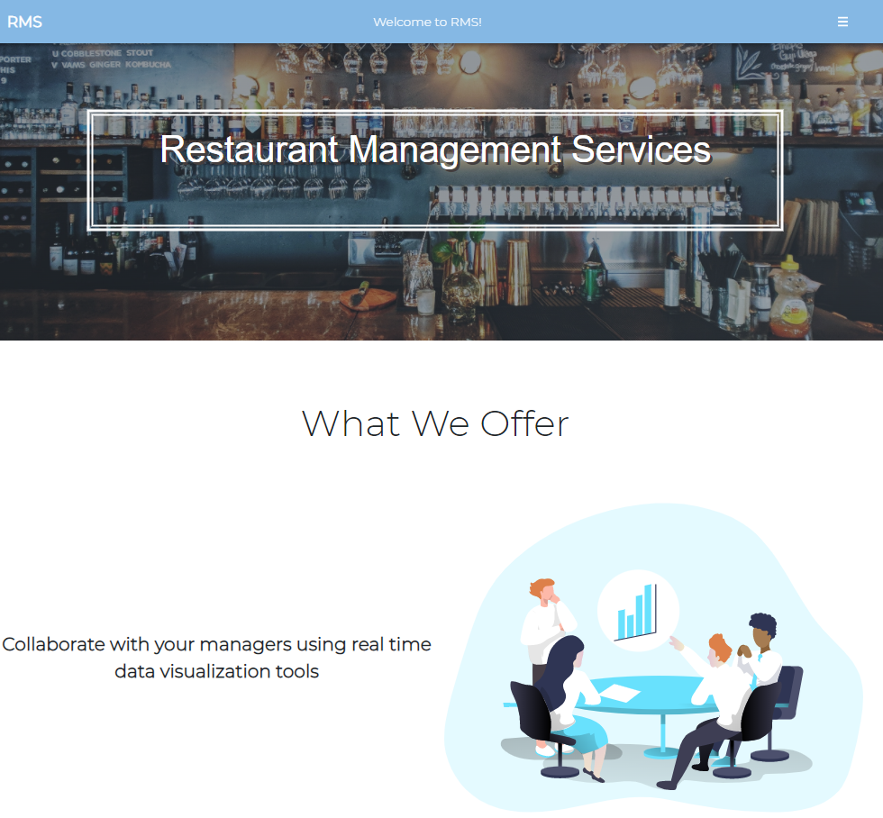

<div id="top"></div>


[![Contributors][contributors-shield]][contributors-url]
[![Forks][forks-shield]][forks-url]
[![Stargazers][stars-shield]][stars-url]
[![Issues][issues-shield]][issues-url]
[![MIT License][license-shield]][license-url]
[![LinkedIn][linkedin-shield]][linkedin-url]


<!-- PROJECT LOGO -->
<br />
<div align="center">
  <a href="https://rms.surge.sh/">
    
  </a>

  <h3 align="center">RMS - Restaurant Management Systems</h3>

  <p align="center">
    Online management tool for business to track inventory, sales, menu items and more. 
    <!-- <br />
    <a href="https://github.com/othneildrew/Best-README-Template"><strong>Explore the docs »</strong></a> -->
    <br />
    <br />
    <a href="https://rms.surge.sh/">View Demo</a>
    ·
    <a href="https://github.com/Wsanders81/RMS/issues">Report Bug</a>
    ·
    <a href="https://github.com/Wsanders81/RMS/issues">Request Feature</a>
  </p>
</div>


<!-- TABLE OF CONTENTS -->
<details>
  <summary>Table of Contents</summary>
  <ol>
    <li>
      <a href="#about-the-project">About The Project</a>
      <ul>
        <li><a href="#built-with">Built With</a></li>
      </ul>
    </li>
    <li>
      <a href="#getting-started">Getting Started</a>
      <ul>
        <li><a href="#prerequisites">Prerequisites</a></li>
        <li><a href="#installation">Installation</a></li>
      </ul>
    </li>
    <li><a href="#usage">Usage</a></li>
    <li><a href="#roadmap">Roadmap</a></li>
    <li><a href="#contributing">Contributing</a></li>
    <li><a href="#license">License</a></li>
    <li><a href="#contact">Contact</a></li>
    <li><a href="#acknowledgments">Acknowledgments</a></li>
  </ol>
</details>


<!-- ABOUT THE PROJECT -->
## About The Project

[![Product Name Screen Shot][product-screenshot]](https://example.com)


<p align="right">(<a href="#top">back to top</a>)</p>


### Built With


* [React.js](https://reactjs.org/)
* [Redux](https://redux.js.org/)
* [Node.js](https://nodejs.org/)
* [Express](https://expressjs.com/)
* [PostgreSQL](https://postgresql.com/)
* [Material UI](https://mui.com)
* [Bootstrap](https://getbootstrap.com)
* [Kendo](https://www.telerik.com/)

<p align="right">(<a href="#top">back to top</a>)</p>


<!-- GETTING STARTED -->
## Getting Started
### Installation

1. Clone repo:
  
   ```sh
   git clone https://github.com/Wsanders81/RMS
   ```
2. Install NPM packages in both frontend and backend folders: 
   ```sh
   cd [frontend_folder]
   npm install
   cd [backend_folder]
   npm install
   ```
3. Set up and seed database using following files: 
   ```sh
   rms.sql
   rms-schema.sql
   rms-seed.sql
   ```
4. Start up server and backend separately
   ```sh
   cd [backend_folder]
   node server.js
   cd [frontend_folder]
   npm start
   ```


### Prerequisites
npm and Node installed


<p align="right">(<a href="#top">back to top</a>)</p>


<!-- USAGE EXAMPLES -->
## Usage

Use this space to show useful examples of how a project can be used. Additional screenshots, code examples and demos work well in this space. You may also link to more resources.

_For more examples, please refer to the [Documentation](https://example.com)_

<p align="right">(<a href="#top">back to top</a>)</p>

## Contributing

Contributions are what make the open source community such an amazing place to learn, inspire, and create. Any contributions you make are **greatly appreciated**.

If you have a suggestion that would make this better, please fork the repo and create a pull request. You can also simply open an issue with the tag "enhancement".
Don't forget to give the project a star! Thanks again!

1. Fork the Project
2. Create your Feature Branch (`git checkout -b feature/AmazingFeature`)
3. Commit your Changes (`git commit -m 'Add some AmazingFeature'`)
4. Push to the Branch (`git push origin feature/AmazingFeature`)
5. Open a Pull Request

<p align="right">(<a href="#top">back to top</a>)</p>

<!-- CONTACT -->
## Contact

Will Sanders - WilliamSanders81@gmail.com

Project Link: [https://github.com/your_username/repo_name](https://github.com/Wsanders81/RMS)

<p align="right">(<a href="#top">back to top</a>)</p>

[contributors-shield]: https://img.shields.io/github/contributors/Wsanders81/RMS.svg?style=for-the-badge
[contributors-url]: https://github.com/Wsanders81/RMS/graphs/contributors
[forks-shield]: https://img.shields.io/github/forks/Wsanders81/RMS.svg?style=for-the-badge
[forks-url]: https://github.com/Wsanders81/RMS/network/members
[stars-shield]: https://img.shields.io/github/stars/Wsanders81/RMS.svg?style=for-the-badge
[stars-url]: https://github.com/Wsanders81/RMS/stargazers
[issues-shield]: https://img.shields.io/github/issues/Wsanders81/RMS.svg?style=for-the-badge
[issues-url]: https://github.com/Wsanders81/RMS/issues
[license-shield]: https://img.shields.io/github/license/Wsanders81/RMS.svg?style=for-the-badge
[license-url]: https://github.com/Wsanders81/RMS/LICENSE.txt
[linkedin-shield]: https://img.shields.io/badge/-LinkedIn-black.svg?style=for-the-badge&logo=linkedin&colorB=555
[linkedin-url]: https://www.linkedin.com/in/williamsanders81/
[product-screenshot]: images/RMS.png
